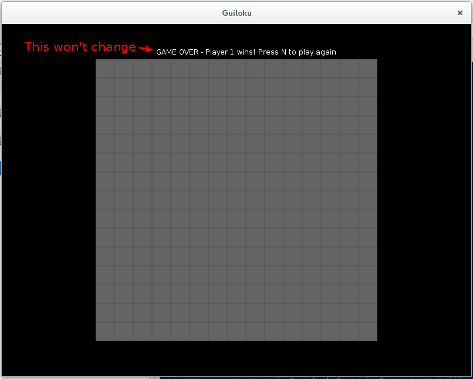
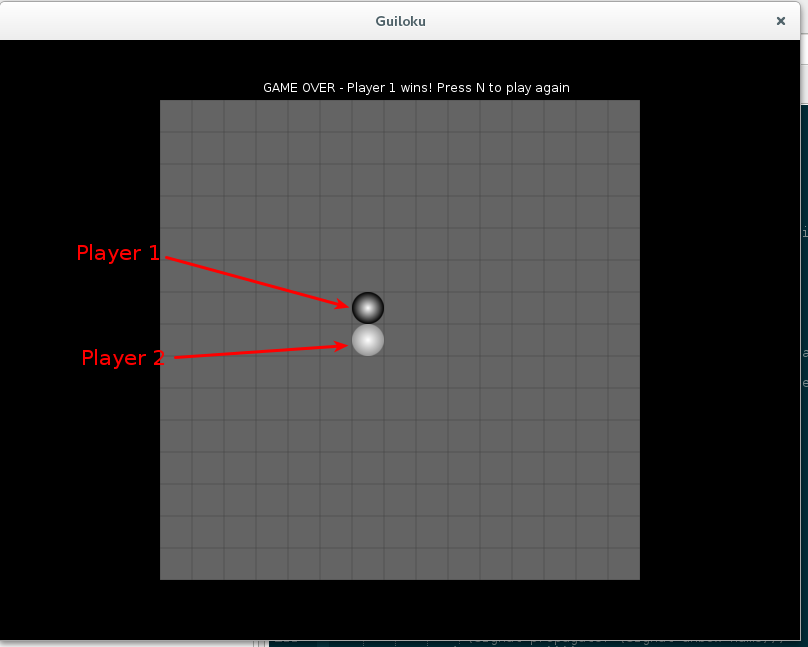
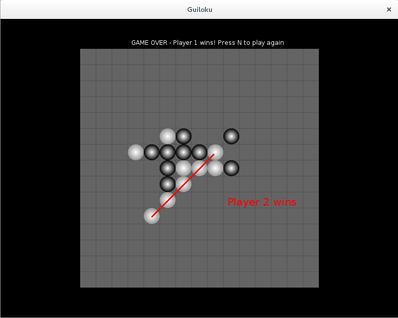

# guiloku

## Introduction

This is a very very bad amalgamation of the names 'Guile' and 'Gomoku' but I'm sticking with it.
The idea is to build a gomoku-like game in guile in the process of learning to use guile

### Gomoku

Gomoku is a strategy board game originating from Japan, where it is referred to as _gomokunarabe_.

You can read more on [Wikipedia](https://en.wikipedia.org/wiki/Gomoku)

## Guiloku

Guiloku is an implementation of Gomoku in [Guile](https://www.gnu.org/software/guile/)

## Dependencies

Guiloku depends on:

* [Guile][guile]
* [sly][sly]

## Installing and Running

1. Install [guix](https://www.gnu.org/software/guix/)
2. Clone [sly][sly]
3. Change directory into sly: `cd /path/to/sly`
4. Build and install [sly][sly]
	* Set up build environment: `guix environment -l guix.scm`
	* bootstrap build environment and configure:`./bootstrap && ./configure`
	* Build sly: `guix build -f guix.scm`
	* Install sly: `guix install -f guix.scm`
5. Clone guiloku: `git clone git@github.com:fredmanglis/guiloku.git`
6. Change directory into guiloku: `cd /path/to/guiloku/`
7. Run guiloku `guile -s guiloku.scm`

## Screenshots

**Note**: _Annotations in red do not appear in actual screens_

On launch:

2 moves in:

And a win whenever there are 5 consecutive stones:

## TODOs

- [x] Make the game playable
- [ ] Fix failure caused by pressing 'n' to start new game
- [ ] Implement automatic game completion and scoring functionality
- [ ] Implement updates to status messages

[guile]:https://www.gnu.org/software/guile/

[sly]:https://dthompson.us/projects/sly.html